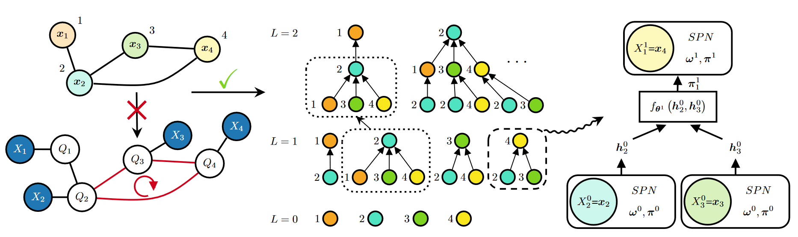

# Graph-Induced Sum-Product Networks (GSPN)

Official Repository of the [ICLR 2024 paper](https://openreview.net/forum?id=h7nOCxFsPg) _"Tractable Probabilistic Graph Representation Learning with Graph-Induced Sum-Product Networks"_.



### Citing us

Please consider citing us if you find the code and paper useful:

    @inproceedings{errica_tractable_2024,
      title={Tractable Probabilistic Graph Representation Learning with Graph-Induced Sum-Product Networks},
      author={Errica, Federico and Niepert, Mathias},
      booktitle={The 12th International Conference on Learning Representations (ICLR)},
      year={2024},
    }

<!-- GSPN-GPT-FIXED: MLWiz reproduction workflow and mathematical corrections. -->
## Environment

This checkout uses **MLWiz 1.7.6**, Python 3.11 or 3.12, PyTorch, PyG, and OGB. Install [uv](https://docs.astral.sh/uv/) and run from this directory:

```sh
uv sync --frozen
uv run pytest
```

The lockfile records the full environment. Research YAMLs retain their original CUDA resource settings; edit the `resources` group for your machine. The combined embedding pipeline uses one device per run; MLWiz can parallelize independent configurations and folds. Optional notebook dependencies are installed with `uv sync --frozen --extra analysis`; launch notebooks with `uv run --extra analysis jupyter lab`.

## Prepare data and preserve splits

The data adapters reuse the original raw graph loaders and ordering. Existing `DATA_SPLITS` files remain unchanged. `mlwiz-data` creates MLWiz dataset metadata and converts the configured saved split automatically, validating index bounds, duplicates, partition separation, and containment in the non-test pool. Inner folds are drawn from outer training **plus validation**, matching both frameworks' nested evaluation convention. Missing legacy artifacts cause an error; OGB datasets without a supplied legacy artifact use their official partitions.

```sh
uv run mlwiz-data --config-file DATA_CONFIGS/config_NCI1.yml
uv run gspn-convert-splits --config-file DATA_CONFIGS/config_NCI1.yml
```

The second command revalidates an existing conversion against the prepared dataset and is idempotent. Converted partitions live in `DATA_SPLITS_MLWIZ`, with source checksums and dataset bounds in adjacent provenance JSON. The conversion command can also take `--source`, `--destination`, and `--dataset-size` for a single artifact. Always supply the actual size when available. Training providers validate loaded partitions again, including files reused by `mlwiz-data`.

Dataset storage roots identify the dataset and processing variant. A processing fingerprint separates incompatible cached samples. Run the matching data configuration before training; OGB baselines have distinct raw-feature adapter configurations, while GSPN retains the original compact categorical encoding.

## Train models

Graph classification from unsupervised embeddings is now one command:

```sh
uv run mlwiz-exp --config-file MODEL_CONFIGS/unsup_model_embedding_classification_CHEMICAL.yml --debug
```

The experiment trains the encoder on the full inner training fold, extracts deterministic training/validation embeddings, and trains the predictor. It never reads outer-test samples during model selection. Final assessment trains a new encoder on outer training data, uses outer validation for stopping, then extracts embeddings and evaluates the predictor on the entire outer test set. Scarce-supervision fractions affect predictor training/validation only. Cached embeddings include sample IDs and are keyed by exact partition order, dataset checksum, transforms, encoder configuration, seed, code fingerprint, and dependency versions.

Supervised graph classification:

```sh
uv run mlwiz-exp --config-file MODEL_CONFIGS/sup_model_embedding_classification_CHEMICAL.yml --debug
```

Scarce supervision with GSPN:

```sh
uv run mlwiz-data --config-file DATA_CONFIGS/config_benzene.yml
uv run mlwiz-exp --config-file WEAK_SUP_MODEL_CONFIGS/unsup_model_embedding_regression_mlp_weak_supervision.yml --debug
```

For GAE or DGI on OGB, prepare the corresponding `config_ogbg-molpcba_OGBGDatasetInterface.yml` in `DATA_CONFIGS` or `DGI_DATA_CONFIGS`. DGI evaluation corruption is deterministic. Encoder-only YAMLs remain available for standalone likelihood experiments; predictor pipelines generate their own embeddings automatically.

Missing continuous features:

```sh
uv run mlwiz-data --config-file DATA_CONFIGS/config_benzene_missing_data.yml
uv run mlwiz-exp --config-file MODEL_CONFIGS/missing_gaussian_molecular.yml --debug
```

Missing-data and synthetic datasets still require raw data generated by the original notebook. Remove `--debug` for MLWiz's parallel search. No full research searches are run as part of verification.

## Implemented corrections and interfaces

Code changes carry `# GSPN-GPT-FIXED` with an explanation. The implementation now marginalizes missing categorical and Gaussian evidence, combines multi-categorical features within a shared mixture component, computes posteriors in log space, and imputes with posterior weights. Categorical imputation returns probabilities; multi-categorical output concatenates one normalized block per feature. One-hot categorical observations must be masked as a whole; integer categorical features can be masked independently.

Shortcuts use preceding layers. Gaussian shortcuts combine variances according to the distribution of an average, rather than averaging standard deviations. Gaussian K-means uses observed training evidence only and honors `init_max_variance`; small batches repeat fitted centers without changing the configured mixture count.

MLWiz models accept `(dim_input_features, dim_target, config)`, with graph dimensions `(node_width, edge_width)`. Dataset samples are `(graph, target)`. The standard engine returns six metric dictionaries; the pipeline extracts node embeddings explicitly. Model outputs remain `(predictions, node_embeddings, extras)`. The first nine extra positions keep their meanings:

| Index | Value |
| --- | --- |
| 0–1 | Node and optional graph log likelihood |
| 2–3 | Original input features |
| 4 | Posterior imputation means/probabilities |
| 5–6 | Missing and observed masks, or `None` without a mask |
| 7–8 | Final prior mixture weights and emission parameters |
| 9 | Conditional missing-feature log likelihood under the same final mixture |

Conditional likelihood is complete minus observed log likelihood. Missing ground truth is excluded from evaluation; an unavailable conditional score is `NaN`, and missing-feature metrics skip it. Completely missing evidence has zero log likelihood and preserves the prior as posterior.

Existing PyDGN checkpoints and embedding caches need regeneration. Outputs use new MLWiz roots and dataset/configuration-specific experiment names; original data and splits are preserved. Analysis notebooks load current final-run artifacts through `notebook_utils.load_run`, and their historical outputs have been cleared. Two configurations referencing absent original modules/classes are retained as `.yml.disabled` files under `ARCHIVED_CONFIGS`; arbitrary SPN templates and Bernoulli extensions are outside this migration.

## Verification

These deterministic CPU commands require no scientific dataset downloads. Their scores are smoke-test values, not paper results:

```sh
uv run mlwiz-data --config-file configs/smoke_data.yml
uv run mlwiz-exp --config-file configs/smoke_supervised.yml --debug
uv run mlwiz-exp --config-file configs/smoke_pipeline.yml --debug
uv run pytest
```

Tests cover analytic likelihoods, masking and input preservation, posterior imputation, shortcuts, gradients, initialization, configuration resolution, exact split conversion, cache invalidation/order, and test-blind pipeline execution. Custom experiments and providers are expected static-audit warnings; their partition and lifecycle behavior is exercised by integration tests.

<!-- GSPN-GPT-FIXED: Promote the verified refactor and document retirement of duplicate code. -->
## Model internals

`model.GSPN` and `model.SupGSPN` are the sole GSPN implementations. Both models, emissions, transitions, and probabilistic graph heads live in `model.py`. Experiment configurations use these canonical paths. `readout.py` retains the embedding predictor classes used by the combined pipeline.

```python
# GSPN-GPT-FIXED: Use the canonical model with named inference and embedding extraction.
from model import GSPN, SupGSPN

config = {
    "num_layers": 2,
    "num_mixtures": 3,
    "emission_class": "model.GSPNGaussianEmission",
    "avg_parameters_across_layers": False,
}
gspn = GSPN((2, 0), 2, config)

# batch is a PyG graph batch with two input features per node.
predictions, embeddings, extras = gspn(batch)  # Existing ten auxiliary outputs.
result = gspn.infer(batch)                    # Named InferenceResult.
node_posteriors = result.node_posteriors       # [nodes, layers, components].
final_posterior = result.layers[-1].posterior
embeddings_only = gspn.encode(batch)          # Skips readout/imputation/diagnostics.
```

`infer(batch, include_imputation=False, include_diagnostics=False)` skips the corresponding optional computations. Graph heads predict without `batch.y`; their graph likelihood is `None` when targets are absent. All inference paths retain gradients. Gaussian initialization is available through `initialize_from_evidence(x, observed_mask)`; it also runs automatically on the first training batch when enabled, and never during evaluation. `observed_mask=True` means observed.

Graph preparation ensures **exactly one self-loop per node**, removing existing self-loop duplicates while retaining non-self edges and their multiplicity. The `add_self_loops` key is rejected and has been removed from active configurations. Isolated nodes receive their own message. This approved loop normalization is the only intentional mathematical difference from the previous implementation.

Custom emissions subclass `GSPNEmission` and implement its component-density, predictive-mean, shortcut, parameter, and value-validity methods. Custom transitions subclass `GSPNBaseConv`, and custom heads subclass `GraphHead`. Their constructor contracts are `(dim_observable, num_components)` via `from_dimensions(...)`, `(num_components, use_prior)`, and `(dim_target, config)`, respectively.

The retired `model_refactored.py`, `sup_model.py`, and duplicate probabilistic heads are removed. Update external imports to `model`; probabilistic readout paths now use `model.ProbabilisticGraphReadout...`. Native saves use `state_dict()` and `load_state_dict()`. For an existing legacy **tensor state dictionary**, `load_reference_state_dict()` validates and translates every parameter and initialization buffer before updating the model. Matching architecture and tensor shapes are required; this does not convert old optimizer states or provide automatic experiment resumption.

GSPN experiment names now end in `_refactored` to create fresh result directories. Existing result artifacts, raw data, and saved splits remain intact. Regenerate framework checkpoints and embeddings for these runs; the embedding cache also includes the changed code fingerprint.

```sh
uv run pytest tests/test_model.py
```

Regression tests replay 569 frozen cases captured from the previously verified original implementation, without importing its code. They check predictions, embeddings, all ten auxiliary outputs, parameter gradients, optimizer updates, and initialization. Additional tests cover loop normalization, named interfaces, extension contracts, input preservation, and CPU training-engine runs. [Fixture provenance](tests/fixtures/README.md) records the source revision and checksums. Float64 comparisons use `rtol=1e-8, atol=1e-10`; float32 comparisons use `rtol=1e-5, atol=1e-6`. Failures report the maximum finite absolute difference.
